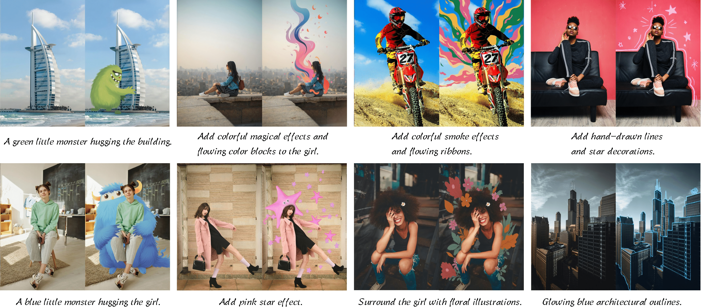

# PhotoDoodle

> **PhotoDoodle: Learning Artistic Image Editing from Few-Shot Pairwise Data**
> <br>
> [Huang Shijie](https://scholar.google.com/citations?user=HmqYYosAAAAJ), 
> [Yiren Song](https://scholar.google.com.hk/citations?user=L2YS0jgAAAAJ), 
> [Yuxuan Zhang](https://xiaojiu-z.github.io/YuxuanZhang.github.io/), 
> [Hailong Guo](https://github.com/logn-2024), 
> Xueyin Wang, 
> and 
> [Mike Zheng Shou](https://sites.google.com/view/showlab),
> [Liu Jiaming](https://scholar.google.com/citations?user=SmL7oMQAAAAJ&hl=en)
> <br>
> [Show Lab](https://sites.google.com/view/showlab), National University of Singapore
> <br>

<a href="https://arxiv.org/abs/2502.14397"></a>
<a href="https://huggingface.co/nicolaus-huang/PhotoDoodle"></a>
<a href="https://huggingface.co/datasets/nicolaus-huang/PhotoDoodle/"></a>

<br>




## Quick Start
### Configuration
#### 1. **Environment setup**
```bash
git clone git@github.com:showlab/PhotoDoodle.git
cd PhotoDoodle

conda create -n doodle python=3.11.10
conda activate doodle
```
#### 2. **Requirements installation**
```bash
pip install torch==2.5.1 torchvision==0.20.1 torchaudio==2.5.1 --index-url https://download.pytorch.org/whl/cu124
pip install --upgrade -r requirements.txt
```


### 2. Inference
We provided the intergration of diffusers pipeline with our model and uploaded the model weights to huggingface, it's easy to use the our model as example below:

```bash
from src.pipeline_pe_clone import FluxPipeline
import torch
from PIL import Image

pretrained_model_name_or_path = "black-forest-labs/FLUX.1-dev"
pipeline = FluxPipeline.from_pretrained(
    pretrained_model_name_or_path,
    torch_dtype=torch.bfloat16,
).to('cuda')

pipeline.load_lora_weights("nicolaus-huang/PhotoDoodle", weight_name="pretrain.safetensors")
pipeline.fuse_lora()
pipeline.unload_lora_weights()

pipeline.load_lora_weights("nicolaus-huang/PhotoDoodle", weight_name="sksmagiceffects.safetensors")

height=768
width=512

validation_image = "assets/1.png"
validation_prompt = "add a halo and wings for the cat by sksmagiceffects"
condition_image = Image.open(validation_image).resize((height, width)).convert("RGB")

result = pipeline(prompt=validation_prompt, 
                  condition_image=condition_image,
                  height=height,
                  width=width,
                  guidance_scale=3.5,
                  num_inference_steps=20,
                  max_sequence_length=512).images[0]

result.save("output.png")
```

or simply run the inference script:
```
python inference.py
```


### 3. Weights
You can download the trained checkpoints of PhotoDoodle for inference. Below are the details of available models, checkpoint name are also trigger words.

You would need to load and fuse the `pretrained ` checkpoints model in order to load the other models.

|                          **Model**                           |                       **Description**                       | **Resolution** |
| :----------------------------------------------------------: | :---------------------------------------------------------: | :------------: |
| [pretrained](https://huggingface.co/nicolaus-huang/PhotoDoodle/blob/main/pretrain.safetensors) |       PhotoDoodle model trained on `SeedEdit` dataset       |    768, 768    |
| [sksmonstercalledlulu](https://huggingface.co/nicolaus-huang/PhotoDoodle/blob/main/sksmonstercalledlulu.safetensors) |   PhotoDoodle model trained on `Cartoon monster` dataset    |    768, 512    |
| [sksmagiceffects](https://huggingface.co/nicolaus-huang/PhotoDoodle/blob/main/sksmagiceffects.safetensors) |      PhotoDoodle model trained on `3D effects` dataset      |    768, 512    |
| [skspaintingeffects ](https://huggingface.co/nicolaus-huang/PhotoDoodle/blob/main/skspaintingeffects.safetensors) | PhotoDoodle model trained on `Flowing color blocks` dataset |    768, 512    |
| [sksedgeeffect ](https://huggingface.co/nicolaus-huang/PhotoDoodle/blob/main/sksedgeeffect.safetensors) |  PhotoDoodle model trained on `Hand-drawn outline` dataset  |    768, 512    |


### 4. Dataset
<span id="dataset_setting"></span>
#### 2.1 Settings for dataset
The training process uses a paired dataset stored in a .jsonl file, where each entry contains image file paths and corresponding text descriptions. Each entry includes the source image path, the target (modified) image path, and a caption describing the modification.

Example format:

```json
{"source": "path/to/source.jpg", "target": "path/to/modified.jpg", "caption": "Instruction of modifications"}
{"source": "path/to/source2.jpg", "target": "path/to/modified2.jpg", "caption": "Another instruction"}
```

We have uploaded our datasets to [Hugging Face](https://huggingface.co/datasets/nicolaus-huang/PhotoDoodle).


### 5. Results


### 6. Acknowledgments  

1. Thanks to **[Yuxuan Zhang](https://xiaojiu-z.github.io/YuxuanZhang.github.io/)** and **[Hailong Guo](mailto:guohailong@bupt.edu.cn)** for providing the code base.  
2. Thanks to **[Diffusers](https://github.com/huggingface/diffusers)** for the open-source project.

## Citation
```
@misc{huang2025photodoodlelearningartisticimage,
      title={PhotoDoodle: Learning Artistic Image Editing from Few-Shot Pairwise Data}, 
      author={Shijie Huang and Yiren Song and Yuxuan Zhang and Hailong Guo and Xueyin Wang and Mike Zheng Shou and Jiaming Liu},
      year={2025},
      eprint={2502.14397},
      archivePrefix={arXiv},
      primaryClass={cs.CV},
      url={https://arxiv.org/abs/2502.14397}, 
}
```
